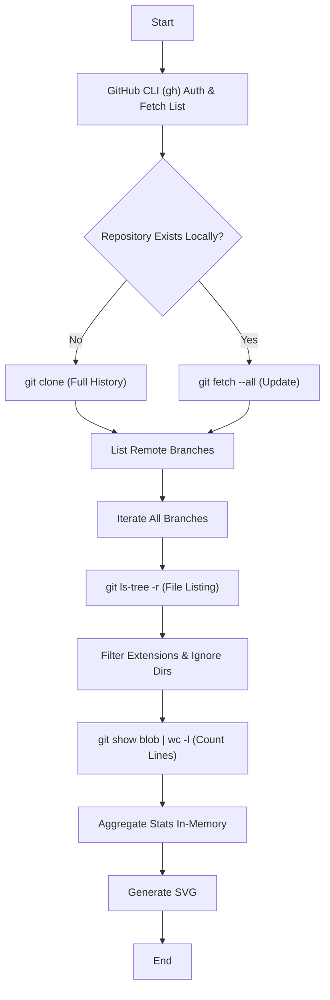

# Maximal Metrics: Local-First GitHub Aggregator

**Maximal Metrics** は、GitHub APIのレート制限や仕様上のバイアス（デフォルトブランチのみの集計）を排除し、GitHub下で管理するコードベースの「総コード行数」を物理的に計測するためのローカル解析エンジンです。

GitHub CLI (`gh`) と連携し、所有する全リポジトリ・全ブランチをローカルに同期、静的解析を行い、その結果を可視化します。

---

## 📖 目次

1. [背景と哲学 (Philosophy)](https://www.google.com/search?q=%23-%E8%83%8C%E6%99%AF%E3%81%A8%E5%93%B2%E5%AD%A6-philosophy)
2. [機能 (Features)](https://www.google.com/search?q=%23-%E6%A9%9F%E8%83%BD-features)
3. [技術的アーキテクチャ (Technical Architecture)](https://www.google.com/search?q=%23-%E6%8A%80%E8%A1%93%E7%9A%84%E3%82%A2%E3%83%BC%E3%82%AD%E3%83%86%E3%82%AF%E3%83%81%E3%83%A3-technical-architecture)
4. [前提条件 (Prerequisites)](https://www.google.com/search?q=%23-%E5%89%8D%E6%8F%90%E6%9D%A1%E4%BB%B6-prerequisites)
5. [インストールと使用法 (Installation & Usage)](https://www.google.com/search?q=%23-%E3%82%A4%E3%83%B3%E3%82%B9%E3%83%88%E3%83%BC%E3%83%AB%E3%81%A8%E4%BD%BF%E7%94%A8%E6%B3%95-installation--usage)
6. [設定とカスタマイズ (Configuration)](https://www.google.com/search?q=%23-%E8%A8%AD%E5%AE%9A%E3%81%A8%E3%82%AB%E3%82%B9%E3%82%BF%E3%83%9E%E3%82%A4%E3%82%BA-configuration)
7. [制限事項とトレードオフ (Limitations)](https://www.google.com/search?q=%23-%E5%88%B6%E9%99%90%E4%BA%8B%E9%A0%85%E3%81%A8%E3%83%88%E3%83%AC%E3%83%BC%E3%83%89%E3%82%AA%E3%83%95-limitations)

---

## 🧐 背景と哲学 (Philosophy)

### The "Default Branch" Bias

既存の多くの可視化ツール（GitHub Insights, Lowlighter Metrics等）は、GitHub API (Linguist) に依存しています。これらは計算コスト削減のため、以下の制約を持っています。

* **デフォルトブランチのみ:** `main` や `master` にマージされていないコードは「存在しない」ものとして扱われる。
* **フォークの除外:** デフォルトではフォークリポジトリは集計されない。
* **APIレート制限:** 大量のリポジトリを持つユーザーは、詳細な解析 (Indepth analysis) を実行できない。

### The Maximalist Approach

しかし、研究開発（R&D）の現場では、ブランチ運用が必ずしも「マージ前提」とは限りません。

* **並行世界の維持:** 「～環境用ブランチ」のように、現場ごとに異なるコードベースが統合されずに長期間運用される。
* **実験的実装:** マージされる保証のない、しかし膨大な工数をかけた実験コード。

本ツールは **「書かれたコードは、マージされようがされまいが、エンジニアのアウトプットである」** という哲学に基づき、全リポジトリ・全リモートブランチのコード行数を物理的に合算（Aggregate）します。

---

## 🚀 機能 (Features)

* **完全網羅的なクローニング:** `gh repo list` を使用し、Public/Private/Fork を問わず全リポジトリを検出。
* **全ブランチ走査:** `git branch -r` により、チェックアウトされていないリモートブランチも含めて解析。
* **インメモリ高速解析:** わざわざ `checkout` を行わず、`git show` とパイプ処理を用いてファイルの中身をストリーム解析。ディスクI/Oを最小化。
* **SVGレポート生成:** GitHub Metrics と互換性のあるデザインで、集計結果をバーチャートとして出力。
* **除外設定:** `node_modules`, `vendor`, `target` (Rust) などの自動生成物を厳密に除外。

---

## 🏗 技術的アーキテクチャ (Technical Architecture)

本システムは、以下のパイプラインで処理を実行します。



### コアアルゴリズム: `git show` vs `checkout`

通常の解析ツールはブランチを切り替える（checkout）ために作業ディレクトリ書き換えコストが発生しますが、本ツールはGitの内部オブジェクトデータベースへ直接アクセスします。

```python
# 概念コード: ブランチを切り替えずに特定バージョンのファイルを読む
subprocess.Popen(['git', 'show', f'{branch}:{file_path}'], stdout=subprocess.PIPE)

```

これにより、巨大なリポジトリであっても高速に、かつ作業ディレクトリを汚さずに解析が可能です。

---

## 📋 前提条件 (Prerequisites)

* **OS:** Windows, macOS, Linux
* **Python:** 3.8 以上
* **Git:** 最新版推奨
* **GitHub CLI (`gh`):** 認証済みであること

```bash
# GitHub CLIの認証確認
gh auth status

```

---

## ⚙️ インストールと使用法 (Installation & Usage)

### 1. リポジトリのクローン

```bash
git clone https://github.com/Funmatu/maximal-metrics.git
cd maximal-metrics

```

### 2. 実行

依存ライブラリはPython標準ライブラリのみを使用しているため、`pip install` は不要です。

```bash
python3 generate_metrics_local.py

```

実行すると、カレントディレクトリに `github_workspace/` ディレクトリが作成され、全リポジトリのクローンが開始されます。初回実行はリポジトリ数に応じて時間がかかります（2回目以降は差分更新のみ）。

### 3. 結果の確認

処理が完了すると、同ディレクトリに `my_full_metrics.svg` が生成されます。これをブラウザで開くか、GitHubのREADMEに埋め込んで使用します。

---

## 🛠 設定とカスタマイズ (Configuration)

`generate_metrics_local.py` 内の定数を変更することで、集計ルールを調整可能です。

### 言語と拡張子の定義

```python
EXTENSIONS = {
    '.py': 'Python',
    '.rs': 'Rust',
    '.js': 'JavaScript',
    # ... 追加したい言語を記述
}

```

### 除外ディレクトリ

ビルドアーティファクトや依存関係を含めないよう設定します。

```python
IGNORE_DIRS = [
    'node_modules/', 
    'venv/', 
    'target/',  # Rust
    'dist/', 
    '.git/'
]

```

---

## ⚠️ 制限事項とトレードオフ (Limitations)

本ツールは「Maximal Metrics」の名の通り、数字を最大化する傾向があります。以下の統計的特性を理解した上で使用してください。

### 1. ブランチ間の重複カウント (Double Counting)

`main` ブランチから派生した `feature-a` ブランチが存在する場合、共通するコードは **2回カウントされます**。

* **この挙動の意図:** 異なるブランチで運用されているコードは、それぞれが独立した「管理対象」であるとみなします。
* **回避策:** 重複を排除したい場合は、このツールではなく `tokei` などを単一ブランチに対して実行してください。

### 2. ディスク容量

全リポジトリをローカルにクローンするため、リポジトリの規模によっては数GB〜数十GBのディスク容量を消費する可能性があります。

### 3. APIとは無関係だがネットワーク帯域を使用

GitHub APIのレート制限には引っかかりませんが、`git clone` による大量のデータ通信が発生します。

---

## 👤 Author

**Funmatu**

* Researcher in Physical AI & Robotics
* Focus: Python, Rust, Multi-agent Systems

---

## 📄 License

MIT License